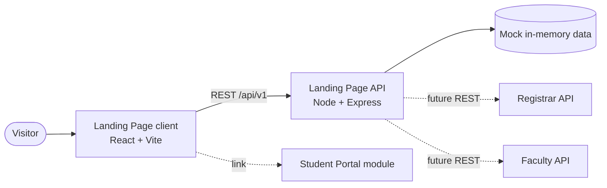
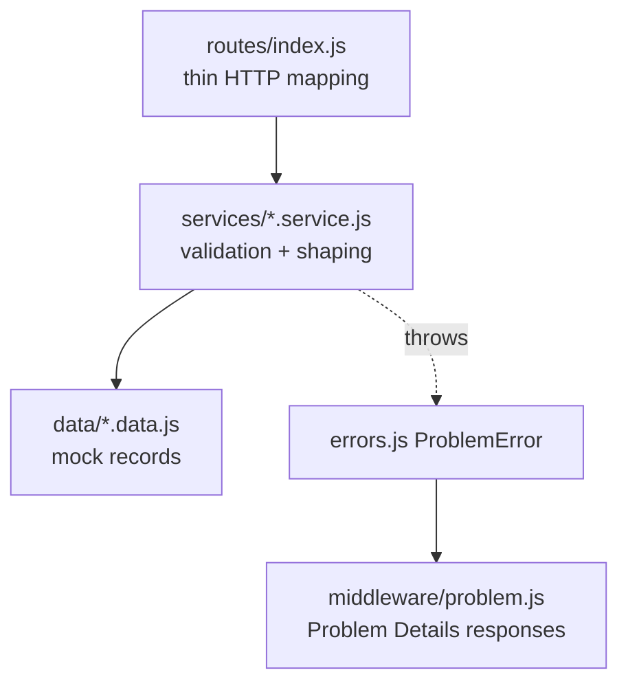

# Architecture

## 1. Overview

The Landing Page module is a React client plus a REST API that serves mock content. It is one of 8 independent modules of the College Management System; modules talk only through their REST APIs.

## 2. System context

Dotted lines are future integrations (see `integration.md`). There is no database and no shared data store.

## 3. Backend layers

No layer is skipped: routes never read `data/`, and `data/` has no logic.

## 4. Request flow

`GET /api/v1/news/news-002` → route calls `news.getNews('news-002')` → service checks the id pattern, looks the article up in `data/news.data.js`, returns a copy → route sends JSON. An unknown id throws `ProblemError(404)`, which the error middleware renders as `application/problem+json`.

## 5. Frontend structure (prototype screens and endpoints)

Every screen also uses `GET /site` (header search, footer, contact) and `GET /navigation` (menus). Design source: [Figma file](https://www.figma.com/design/BpFsOPmNJjEHGxVgl1QuwN/Web-Design-Landing-Page-Main?node-id=43-14).

| Route | Figma frame | Endpoints (besides site, navigation) |
|---|---|---|
| `/` | Landing Page | `/news`, `/enrollment`, `/pulse`, `/statistics` |
| `/programs/college` | PROGRAM COLLEGE UI | `/programs?level=college` |
| `/programs/shs` | PROGRAM SHS UI | `/programs?level=shs` |
| `/admission/requirements` | ADMISSION REQUIREMENT UI | `/admission/requirements`, `/admission/process` |
| `/admission/tuition` | ESTIMATED TUITION FEE UI | `/admission/tuition` |
| `/admission/payment-instructions` | ALTERNATIVE PAYMENT UI | `/admission/payment-instructions` |
| `/about` | ABOUT IDSC UI | `/about` |
| `/about/vision-mission` | VISION, MISSION & CORE VALUES | `/about` (title only) |
| `/about/hymn` | IDSC HYMN UI | `/about` (title only) |
| `/facilities/laboratories` | LABORATORIES UI | `/facilities` (title only) |
| `/facilities/academic-spaces` | ACADEMIC SPACE UI | `/facilities` (title only) |
| `/facilities/clinic` | CLINIC UI | `/facilities` (title only) |
| `/pre-registration` | REGISTER UI | `/enrollment`, `/admission/process` (information only) |

`/news` and `/news/{id}` are available to the client; the Figma file has no dedicated news page frame, so the client reuses the home-page notice cards.

## 6. Cross-cutting decisions

* **Errors:** RFC 9457 everywhere. **CORS:** only `FRONTEND_URL`, `GET/HEAD/OPTIONS`. **Docs:** Swagger UI serves the same `openapi.yaml` that the tests validate.
* **Decisions:** [ADR-001](decisions/ADR-001-mock-api.md) mock API, [ADR-002](decisions/ADR-002-backend-framework.md) Express.
