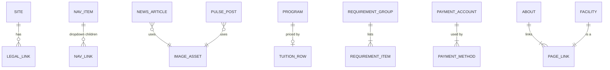

# Data Model

All entities are mock, in-memory records (`server/data/`). Field names and types match `server/openapi.yaml`.

| Entity | Key fields |
|---|---|
| Site | `name`, `abbreviation`, `city`, `tagline`, `logo`, `headerCta`, `contact{email, phone, officeHours}`, `legal` |
| NavigationItem | `id`, `label`, `href` (null for dropdown-only), `children[]` |
| NewsArticle | `id` (`news-NNN`), `title`, `summary`, `category`, `publishedOn`, `image`, `featured`, `body[]` (detail only) |
| Enrollment | `hero`, `callToAction{actions[]}`, `support` |
| PulsePost | `id` (`pulse-NNN`), `title`, `summary`, `icon`, `postedOn`, `image` |
| Statistic | `id`, `label`, `value`, `tone`, `provider{module, isMock}` |
| Program | `id` (`program-NNN`), `level` (`college`\|`shs`), `code`, `name`, `fullName`, `major`, `department`, `duration`, `icon` |
| RequirementGroup | `id` (`shs`\|`college`\|`transferees`), `badge`, `title`, `items[]` |
| ProcessStep | `step`, `title`, `summary`, `icon` |
| TuitionRow | `programId` (nullable), `program`, `estimatedFee` (nullable) |
| PaymentInstructions | `account`, `methods[]` (`online-banking`, `gcash`), `importantNote` |
| PageLink | `id`, `title`, `href`, `contentStatus` (`available`\|`title-only`) |

## ID formats

This module defines `news-NNN`, `pulse-NNN`, `program-NNN`. It does not store students or employees, so `studentId` (Registrar, for example `2026-00123`) and `employeeId` (Faculty) do not appear here.

## Data notes taken from the design

* The Figma statistics label "FULL-TIME FACULTU" is corrected to "Full-time Faculty".
* BSIT appears in the tuition table but not among the 9 program cards, so its tuition row has `programId: null`.
* The design uses two school-name spellings ("System Colleges" in header/footer, "Systems Colleges" in the payment panel) and two emails (`idscollegesinc@gmail.com` in the footer, `idscolleges@yahoo.com` for proof of payment). Both are kept where the design uses them.
* Card names in the design are abbreviated ("B of Secondary Education"); the API uses the full name.
* The design's Pulse cards showed gray image boxes and sample labels; the mock data provides real titles, summaries and images.
